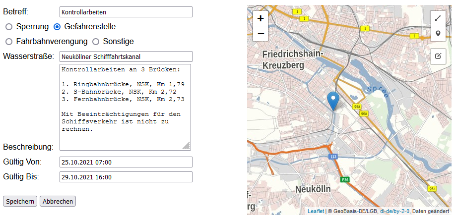

# Erfassungstool für Schifffahrtsmeldungen auf Landeswasserstraßen

Weboberfläche um Meldungen zu Sperrungen und sonstigen Beeinträchtigungen auf Landeswasserstraßen in Berlin zu erfassen.

Die erfassten Meldungen werden als GeoJSON in einem Azure-Speicherkonto zur Verfügung gestellt.




## Parameter

Einige Zugangsdaten müssen über Systemvariablen konfiguriert werden.
Wenn der Service als Docker-Container läuft können diese als Umgebungsvariablen in Docker gesetzt werden.

* **USER/PASSWORD** - Authentifizierungsdaten für die Erfassungsoberfläche
* **MESSAGE_TYPES** - Liste der verfügbaren Meldungstypen. Format:```<Key>:<Anzeigename>``` - Listentrenner:```;``` 


* **AZURE_CONN_STR** - Verbindungsdaten des Azure-Speicherkonto.
* **AZURE_CONTAINER_NAME** - Name des Zielcontainers (Blob-Container) im Azure-Speicherkonto.
* **AZURE_BLOB_NAME_STORE** - Pfad und Name der Persistenzdatei innerhalb des Blob-Containers.
* **AZURE_BLOB_NAME_Export** - Pfad und Name der Exportdatei innerhalb des Blob-Containers. Diese enthält nur die Einträge, deren Gültigkeit noch nicht abgelaufen sind. 


* **HOST** - Hostname des Servers - Default:```localhost```
* **PORT** - Port der Anwendung - Default:```8000```

## Docker Image bauen und in GitHub Registry pushen

```bash
> docker build -tdocker.pkg.github.com/digitale-plattform-stadtverkehr-berlin/lawabe/lawabe:<TAG> .
> docker push docker.pkg.github.com/digitale-plattform-stadtverkehr-berlin/lawabe/lawabe:<TAG>
```
